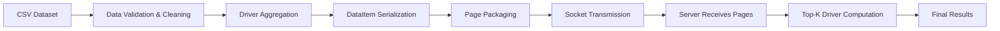

# Parallel and Distributed Systems Project

A Java-based distributed client/server system that processes large datasets by coordinating communication, validation, and efficient data handling across components. This project demonstrates experience with networking, serialization, distributed computation, and scalable system design.

## Team

- Sanchana Shanmuga
- Victoria Reddy

## Overview

This project explores core ideas in parallel and distributed systems:

- client/server communication over sockets
- data serialization and deserialization
- fixed-size page-based transmission
- stream processing over batches of records
- aggregation and ranking using a top-k approach
- validation and cleaning of large real-world datasets

The application simulates a distributed workflow where the client prepares data locally and the server processes it incrementally without needing to hold the entire dataset in memory at once.

## System Architecture



### High-level flow

1. The client reads the taxi CSV file and validates each record.
2. Malformed or inconsistent records are filtered out.
3. Valid records are aggregated by driver ID.
4. Each driver is represented as a compact `DataItem` object.
5. Data is serialized into byte arrays and grouped into fixed-size pages.
6. The server receives each page and processes data incrementally.
7. A priority queue keeps only the best drivers seen so far.

## What I Learned

### 1. Distributed systems fundamentals

This project demonstrates a very small distributed architecture in which separate processes communicate over a network:

- a client prepares and sends data
- a server receives and processes it
- communication is handled with Java sockets

This mirrors the core idea behind distributed systems: tasks are split across components and data moves between them through explicit protocols.

### 2. Serialization and memory-efficient data transfer

Because data is sent over a network, it must be converted into a byte representation. In this project, each `DataItem` is serialized manually using `ByteBuffer`.

Key ideas:

- store string length before payload
- write integer and double values in a specific binary order
- deserialize using the same format on the receiving end

This is important in real distributed systems, where message format compatibility is essential.

### 3. Batching and paging

Large datasets cannot always be sent as a single message. The code packs records into fixed-size pages using `Const.PAGESIZE` and sends them sequentially.

This introduces a practical system design pattern:

- break large workloads into smaller chunks
- send each chunk independently
- process each chunk as it arrives

That reduces the memory burden and makes streaming processing possible.

### 4. Data validation and cleaning

Raw taxi data often contains malformed or inconsistent records. The client performs validation by checking:

- column count
- numeric parsing
- fare consistency
- invalid or empty identifiers
- outlier values that do not match expected constraints

This shows how real-world datasets need cleaning before they can be processed reliably in a distributed pipeline.

### 5. Aggregation and top-k processing

The project computes the drivers with the highest total earnings. Instead of storing everything, the server keeps a bounded priority queue of the best candidates.

This is an example of a common distributed data processing pattern:

- aggregate values as data arrives
- track only the most relevant results
- reduce the final output size

This is conceptually similar to top-k analytics often used in ranking systems and large-scale data pipelines.

## Data Flow Diagram

```text
Client Side                                 Server Side
-----------                                 ------------
| Taxi CSV |                                  | Socket Listener |
|          |                                  |                 |
| Clean    | ---- validate + aggregate ----> | Receive page    |
| Parse    |                                  | Parse bytes     |
| Serialize| ---- page data ---------------> | Update heap     |
| Send     |                                  | Keep top K      |
-----------                                 ------------
      |                                              |
      |----------------------------------------------|
                     ACK / Continue Signal
```

## Implementation Highlights

### Client responsibilities

- read dataset from `taxi-data-sorted-small.csv`
- validate and filter invalid rows
- aggregate total earnings per driver
- remove duplicate medallions for each driver
- serialize entries into pages
- send pages to the server

### Server responsibilities

- wait for incoming socket connections
- read page payloads from the client
- deserialize each `DataItem`
- aggregate totals into a priority queue
- keep the highest earning drivers
- print final results when processing is complete

## Key Technologies

- Java
- Maven
- Java Sockets
- ByteBuffer serialization
- PriorityQueue for top-k tracking
- CSV parsing and validation

## Repository Structure

```text
.
├── src/
│   ├── main/java/edu/utexas/cs/cs378/
│   │   ├── Const.java
│   │   ├── DataItem.java
│   │   ├── MainClient.java
│   │   ├── MainServer.java
│   │   └── Utils.java
│   └── test/java/edu/utexas/cs/cs378/
│       ├── TestPages.java
│       └── TestSerialization.java
├── pom.xml
├── README.md
├── taxi-data-sorted-small.csv
└── LICENSE
```

## Getting Started

### Prerequisites

- Java 8+
- Maven installed and available on your PATH

### Compile the project

```bash
mvn clean compile
```

### Run the server

```bash
mvn clean compile exec:java@server -Dexec.args="33333"
```

### Run the client

```bash
mvn clean compile exec:java@client -Dexec.args="2000000 localhost 33333"
```

### Notes

- `2000000` is the batch size used by the client.
- Replace `localhost` with the target machine IP when running on different machines.
- For long-running remote execution, you can run it in the background:

```bash
nohup mvn clean compile exec:java@client -Dexec.args="2000000 localhost 33333" &
```

## Project Takeaway

This project brings together several important ideas from distributed and parallel systems:

- communication between processes
- data movement and serialization
- memory-aware processing
- streaming computation
- data cleaning and reduction
- ranking and aggregation in real time

It is a strong example of how distributed systems are designed to process large amounts of data efficiently and reliably.

## License

This project is available under the repository license included in the project files.


